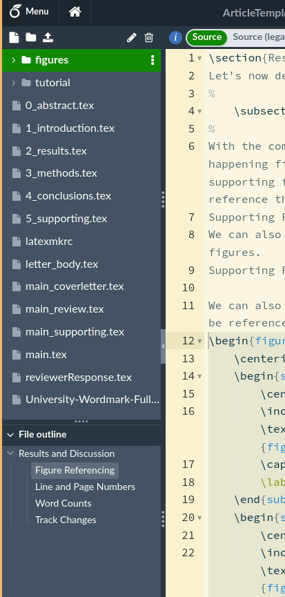
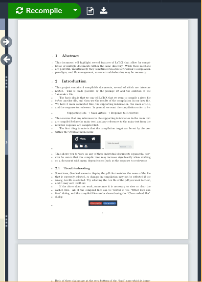

# Article Template

This directory contains an article template which enables the following functionality in Overleaf:
- Supporting Information is compiled as a separate document which can be referenced in the main text
- The Response to Reviewers can be compiled as a separate document that refrences line numbers, page numbers, and labels from the main text
- The Cover Letter can be compiled as a separate document in the same directory

The `ArticleTemplate.zip` file contains the contents of this directory in full, and can be uploaded to Overleaf to compile.

Using this article in Overleaf requires that you know how to change the compile target.
This is done through the Overleaf main menu, as shown below:

It may also be necessary to clear the cache, or view specific compiled objects, which is shown here:

